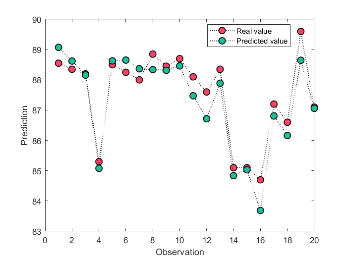
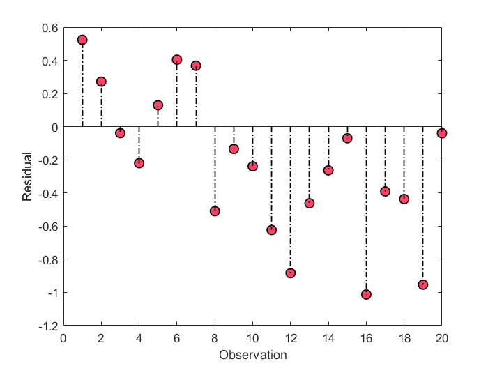
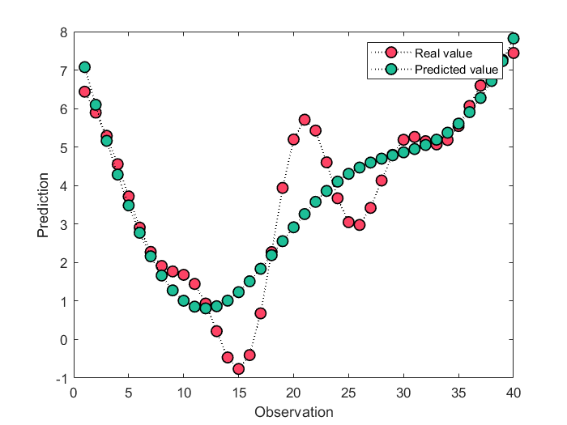
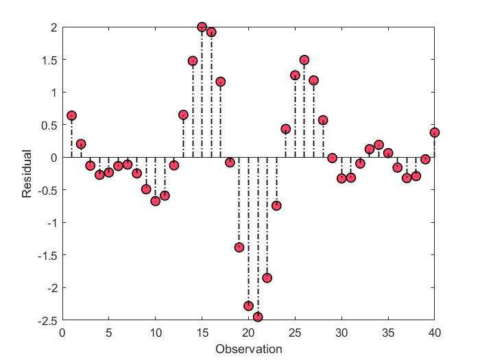
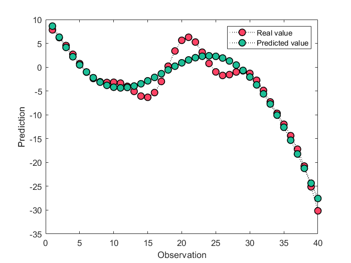
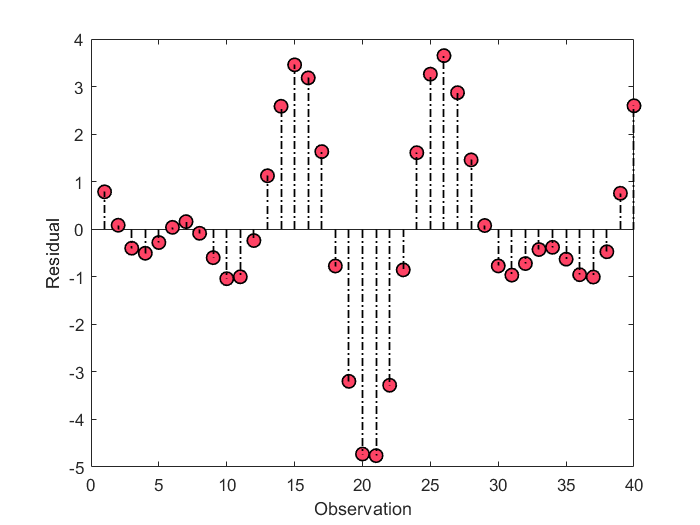

# Gaussian Process Regression
 Gaussian Process Regression using GPML toolbox
 
## Description
+ This code is based on the GPML toolbox V4.2.
+ Provided two demos (multiple input single output & multiple input multiple output).
+ Use ***feval(@ function name)*** to see the number of hyperarguments in a function. For example:
```
K > > feval (@ covRQiso)
Ans =
'(1 + 1 + 1)'
```
It shows that the covariance function ***covRQiso*** requires 3 hyperparameters. Therefore, 3 hyperparameters need to be initialized when using the optimization function ***minimize***. The meaning and range of each hyperparameter are explained in detail in the description of each function. 
+ Different likelihood functions have different inference function requirements, which can be seen in detail ***./gpml-matlab-v4.2-2018-06-11/doc/index.html*** or ***./gpml-matlab-v4.2-2018-06-11/doc/manual.PDF***.

## demo 1
```
clc
close all
clear all
addpath(genpath(pwd))

% load data
%{
x :   training inputs
y :   training targets
xt:   testing inputs
yt:   testing targets
%}

% multiple input-single output
load('./data/data_1.mat')


% Set the mean function, covariance function and likelihood function
% Take meanConst, covRQiso and likGauss as examples

meanfunc = @meanConst;
covfunc = @covRQiso; 
likfunc = @likGauss; 

% Initialization of hyperparameters
hyp = struct('mean', 3, 'cov', [0 0 0], 'lik', -1);


% meanfunc = [];
% covfunc = @covSEiso; 
% likfunc = @likGauss; 
% % Initialization of hyperparameters
% hyp = struct('mean', [], 'cov', [0 0], 'lik', -1);


% Optimization of hyperparameters
hyp2 = minimize(hyp, @gp, -20, @infGaussLik, meanfunc, covfunc, likfunc,x, y);

% Regression using GPR
% yfit is the predicted mean, and ys is the predicted variance
[yfit ys] = gp(hyp2, @infGaussLik, meanfunc, covfunc, likfunc,x, y, xt);

% Visualization of prediction results
plotResult(yt, yfit)
```
### results
  

## demo 2
```
clc
close all
clear all
addpath(genpath(pwd))

% load data
%{
x :   training inputs
y :   training targets
xt:   testing inputs
yt:   testing targets
%}

% multiple input-multiple output
load('./data/data_2.mat')


% Set the mean function, covariance function and likelihood function
% Take meanConst, covRQiso and likGauss as examples
meanfunc = @meanConst;
covfunc = @covRQiso; 
likfunc = @likGauss; 

% Initialization of hyperparameters
hyp = struct('mean', 3, 'cov', [2 2 2], 'lik', -1);


% meanfunc = [];
% covfunc = @covSEiso; 
% likfunc = @likGauss; 
% 
% hyp = struct('mean', [], 'cov', [0 0], 'lik', -1);


% Optimization of hyperparameters
hyp2 = minimize(hyp, @gp, -5, @infGaussLik, meanfunc, covfunc, likfunc,x, y);

% Regression using GPR
% yfit is the predicted mean, and ys is the predicted variance
[yfit ys] = gp(hyp2, @infGaussLik, meanfunc, covfunc, likfunc,x, y, xt);

% Visualization of prediction results
% First output
plotResult(yt(:,1), yfit(:,1))
% Second output
plotResult(yt(:,2), yfit(:,2))
```
### first output
 

### second output
  
